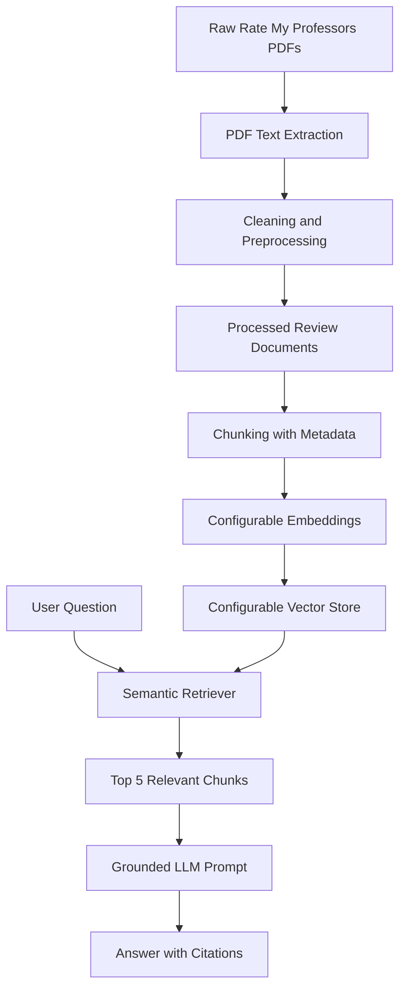

# Architecture

## Components

- `scripts/ingest.py`: loads PDFs, extracts text, cleans review text, and writes processed documents.
- `scripts/preprocess.py`: contains reusable cleaning, professor naming, theme extraction, and summary helpers.
- `scripts/rag.py`: chunks processed documents, builds the configured vector store, retrieves top 5 chunks, and generates grounded answers.
- `scripts/embed.py`: builds the persistent vector store in `vectordb/`.
- `app.py`: Streamlit demo interface for asking questions and inspecting retrieved chunks.
- `scripts/evaluate.py`: runs the five-question evaluation and writes `docs/evaluation_report.md`.

## Data Flow

1. Manually collected PDFs are placed in `data/raw/`.
2. The ingestion script extracts and cleans text.
3. The pipeline writes review and summary Markdown files to `data/processed/`.
4. The embedding script chunks documents with metadata and stores embeddings in the configured vector store.
5. The app embeds a user query, retrieves top 5 chunks, and sends only those chunks to the LLM.
6. The selected LLM returns an answer with evidence and source citations.

## Configurable Adapters

The current implementation defaults to OpenAI embeddings, OpenAI grounded generation, ChromaDB vector storage, optional LangChain splitting helpers, and a Streamlit UI. These are implementation choices, not assignment requirements. The architecture can support other embedding providers, vector databases, generation models, and query interfaces through the same ingestion, chunking, retrieval, grounding, attribution, and evaluation stages.
